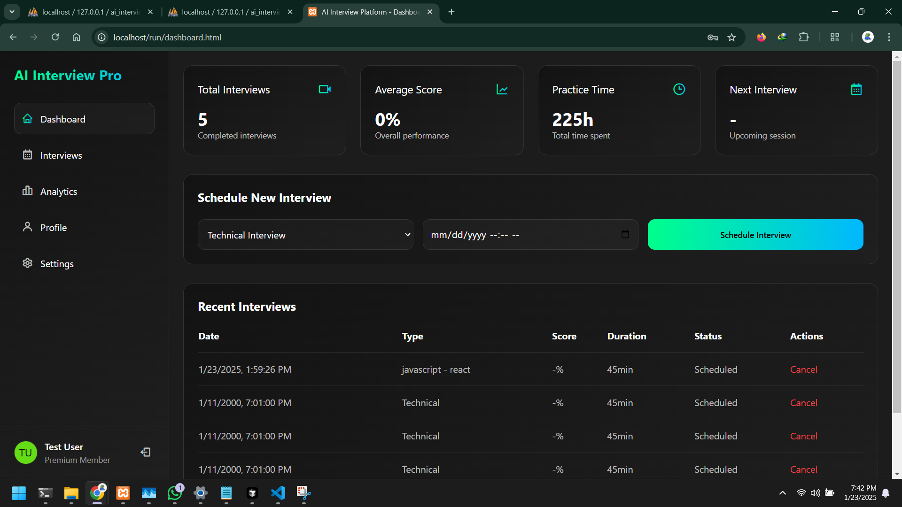
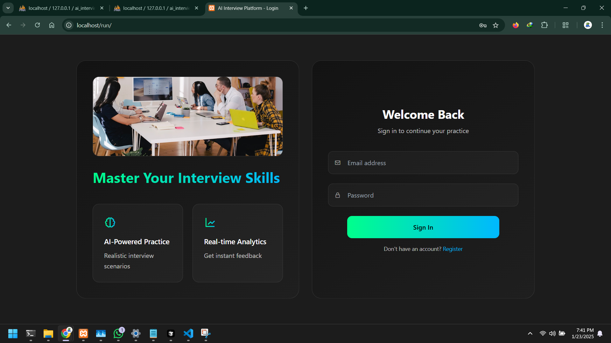
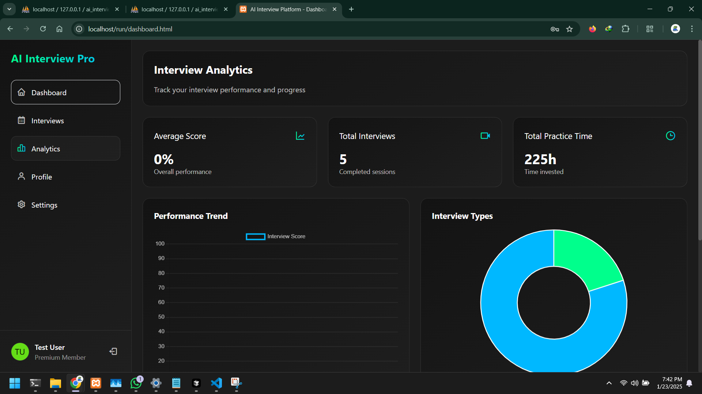
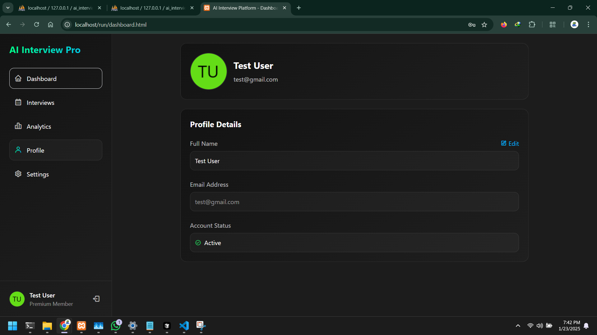

# 🤖 AI Interview Pro

A modern platform for practicing technical interviews with AI. Built with Spring Boot and modern web technologies.  
**Note**: Replace the Cloudflare account ID and token with your own token. These tokens are hardcoded because this project is not meant for personal use only.

<div align="center">
  
</div>


## ✨ Features

- AI-powered technical interviews
- Real-time performance analytics
- Voice interaction support
- CV/Resume parsing
- Responsive design

<div align="center">
  
  <br><br>
  
  <br><br>
  
  <br><br>
  
</div>

## 🛠️ Tech Stack

### 🔙 Backend
- Spring Boot
- MySQL
- REST API
- JPA/Hibernate

### 🎨 Frontend
- HTML5, JavaScript
- TailwindCSS
- Chart.js
- Speech API

## 📁 Project Structure

```
src/main/java/com/aiinterviewpro/
├── AiinterviewproApplication.java
├── controllers/
├── models/
└── repositories/
```

## 🚀 Quick Start

1. Clone repository
2. Configure MySQL database
3. Run `./mvnw spring-boot:run`
4. Visit `http://localhost:8080`

## 🤝 Contributing

PRs welcome! Open an issue first for major changes.

## 📄 License

[MIT](https://choosealicense.com/licenses/mit/)
